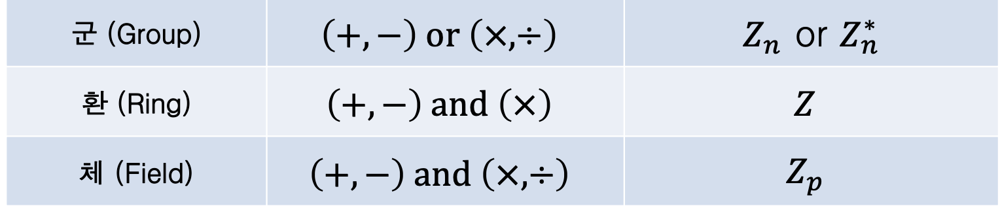
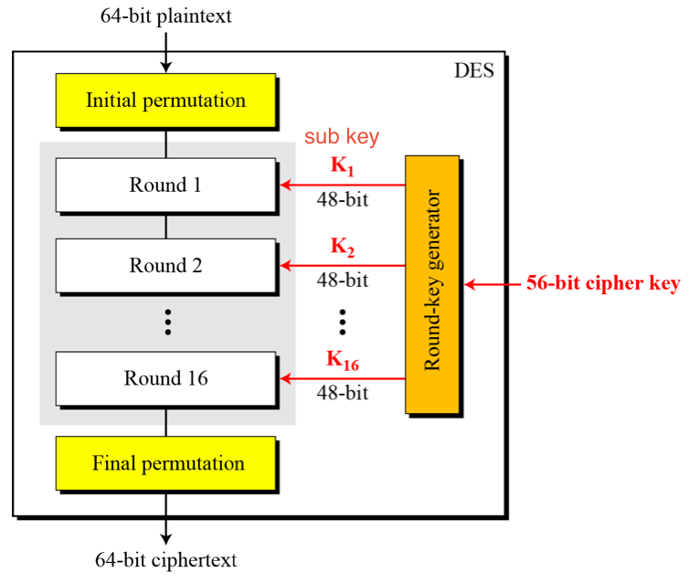
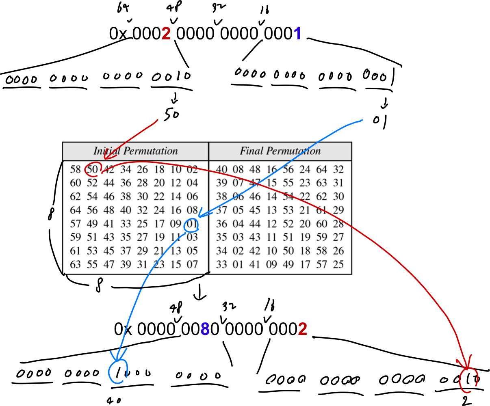
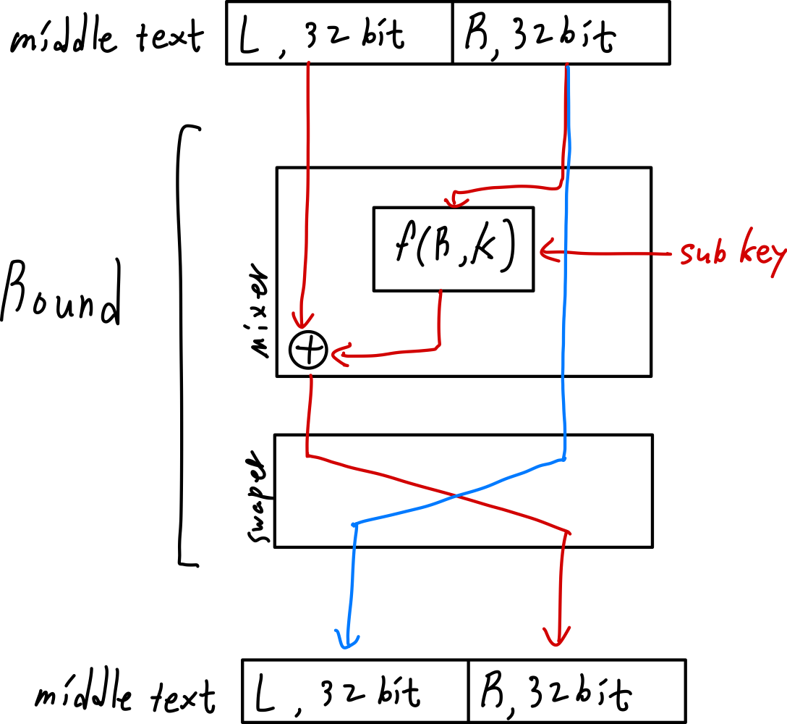
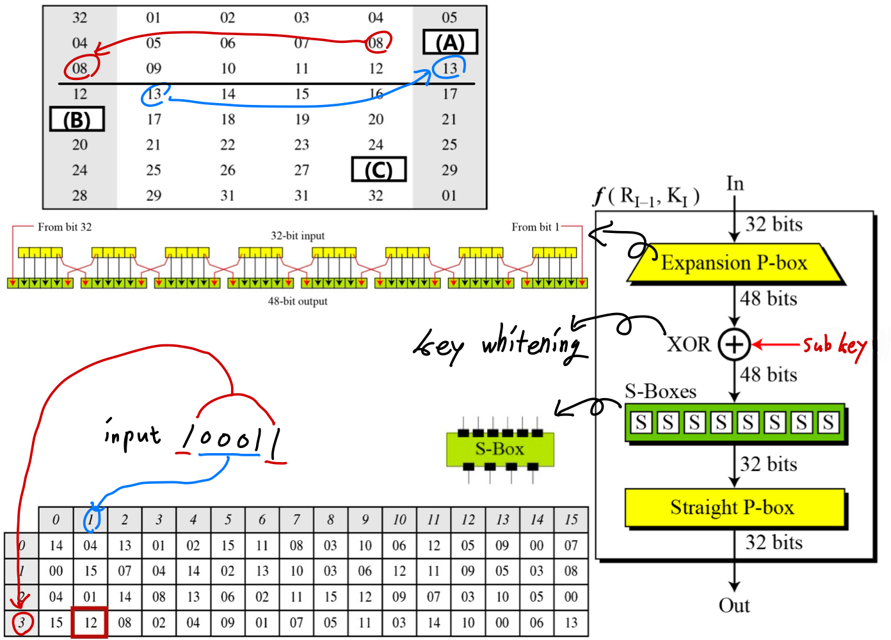
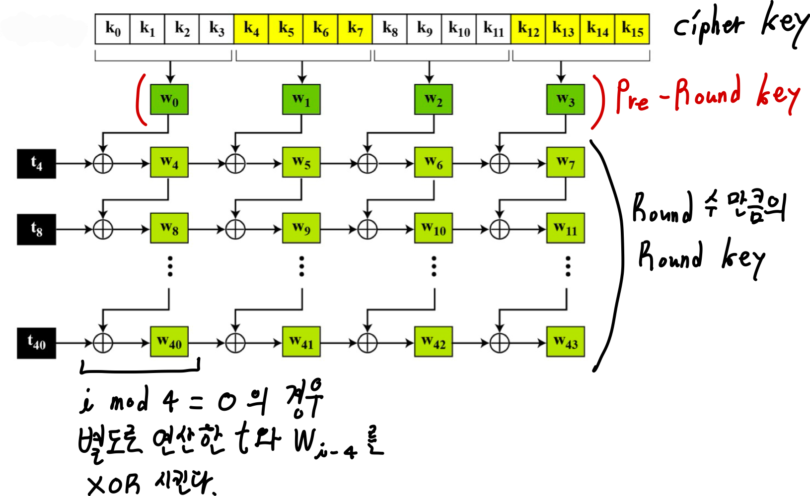
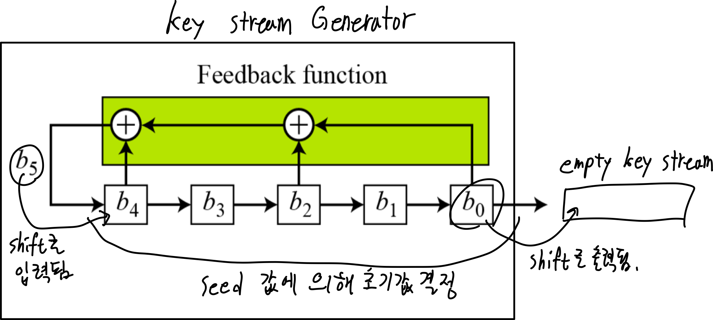

# cryptography

# overall concept
- 용어  
plain text : 평문, 원본 데이터  
cipher text : 암호문  
encryption / decryption : 암호화/복호화  
key : 사전에 약속된 value  
복호화 : 합법  
해독 : 합법/불법  

- 암호의 기능
   1. 기밀성(Confidentiality)
   2. 무결성(Integrity)
   3. 인증(Authentication) : 디지털 정체성 식별
   4. 부인 봉쇄(Non-repudiation) : 정보를 보낸 사람이 나중에 정보를 보냈다는 것을 부인하지 못하도록 하는 기능

- 암호 설계 목표
   1. 안정성 확보
      계산적 안전성 : 공격 시 필요한 계산량이 아주 많음  
      증명 가능한 안전성: 수학적으로 어렵다고 증명된 문제로 알고리즘 구성 -> 현실적으로 해결(공격) X. (ex)소인수분해의 어려움, 이산대수 문제의 어려움  
      절대적 안전성: ㄹㅇ무적  
   2. 해독 비용 > 정보의 가치가 되도록  
   3. 암호 해독 시간 > 정보의 유효 기간이 되도록  
   4. Kerckhoffs : 암호 알고리즘보단 키의 비밀 지키자  

- 암호 관계도
1. symmetric key
   Block Cipher
      Substitution Cipher
      Transposition Cipher
   Stream Cipher
      Substitution Cipher
2. asymmetric key
   public key 
   private key

- Substitution Cipher의 종류
단일 문자 대치 : 덧셈, 곱셈, 아핀  
다중 문자 대치 : 자동 키, Vigenere, hill, Rotor  

- Transposition Cipher의 종류
rail fence, 열 전치  

- asymmetic key의 2 가지 용도
1) message encrypt  
   public -> encryption  
   private -> decryption  
2) Electronic signature, authentication  
   public -> decryption    
   private -> encryption  

- 연산 기호
이상, 이하 - [ ],  초과, 미만 - ( )  
특정 연산 == @  

- 암호는 정수 집합에서 동작  
임호화 키 -> 정수  
복호화 키 -> 해당 정수의 역원  

- 항등원/역원  
   1. 암/복호화 알고리즘의 연산이 덧셈 연산  
      -> Zn에 속한 모든 정수가 덧셈에 대한 역원  
      -> Zn 내의 모든 수가 키  
   2. 암/복호화 알고리즘의 연산이 곱셈  
      -> 곱셈에 대한 역원을 갖는 원소 집합을 사용해야 함.  
      -> 확장 유클리드 알고리즘을 이용하여 구할 수 있다.  

# 수학적 구조
### identity / inverse
- identity  
x @ y = x 인 원소 y  
ex) 덧셈 - 0, 곱 - 1  

- inverse  
x @ y = identity 인 원소 y  
ex 1) 덧셈 연산에 대한 역원  
	x + y = 0  
	∵ y = -x  
ex 2) 곱셈 연산에 대한 역원 → 1  
	x * y = 1  
	∵ y= 1 / x  
=> inverse가 있다 == 복호화가 가능하다 == 암호화의 key로써 기능을 할 수 있다  

### euclidean algorithm
- 나눗셈 연산
Binary operator : 2 input 1 output
but 나눗셈은 몫과 나머지를 산출하므로 이항연산이 아님. 이는 관계식으로 표현함.
a = qn + r
q r : 몫/나
a n : 피제/제
암호학에서는 n과 r이 양수여야 함.
그러나 a가 음수인 경우 q r이 음수가 됨
-> q에 -1을 가하고, n을 더한다 -> 일종의 테크닉. 계산해보면 같은 값이 나오는 식이지만 제약조건에 맞게 됨.

- 가분성 Divisibility
n | a -> a % n == 0
n ∤ a -> a%n != 0
property
   1) if ( 𝑎 | 1 ) { 𝑎 = ± 1 }
   2) if ( 𝑎 | 𝑏  &&  𝑏 | 𝑎 ) { 𝑎 = ± 𝑏 }
      b=xa, a=yb
      b=xyb 
      -> xy=1
   3) if (𝑎 | 𝑏  &&  𝑏 | 𝑐 ) { 𝑎 | 𝑐 }
      b = xa, c = yb
      c = y(xa) = (xy)a 
      -> 𝑎 | 𝑐
   4) if( 𝑎 | 𝑏  &&  𝑎 | 𝑐 ) { 𝑎 | 𝑚𝑏 + 𝑛𝑐 }  (단, 𝑚, 𝑛 ∈ Z)
      b = xa, c = ya
      mb + nc = mxa + nya = (mx + ny)a
      -> 𝑚𝑏 + 𝑛𝑐

- euclidean algorithm
   divisor (약수)
   common divisor (공통 약수)
   greatest common divisor (최대 공통 약수)

   gcd(a, 0) = a
   gcd(a, b) = gcd(b, r)  //(r == a%b)

   확장 유클리드 알고리즘
   베주 항등식?
   두 개의 정수 𝒂와 𝒃가 주어졌을 때, 𝐠𝐜𝐝(𝒂, 𝒃)와 함께 다음을 만족하는 다른 두 정수 𝒔와 𝒕를 동시에 계산한다.
   𝒔𝒂 + 𝒕𝒃 = 𝐠𝐜𝐝 (𝒂, 𝒃)

### Group, Ring, Field

- Group
G=<Set, Operator>
Set : finit or infinit
order : number of Set's element
Operator : 1개. 단, 역함수 관계에 있는 연산자는 사용가능
property :
   1. Closure : if (a oper b = c) & (a b in Set), c in Set
   2. Associativity : 결합 법칙
   3. Existence of identity
   4. Existence of inverse
   5. (if commutative group) commutativity (교환 법칙)

- Ring
R=<Set, Operator_1, Operator_2>
operator_1 : commutative group's operator
operator_2 : 
   닫힘, 결합, 분배 (if commutative R, 교환). 
   항등원/역원이 없을수도 있음(역함수 관계에 있는 연산자라도 사용 불가)
property :
   1. Closure
   2. Associativity
   3. (if commutative Ring) commutativity

- Field
수학에서 일반적으로 사용되는 덧셈/뺄셈, 곱셈/나눗셈 연산의 두 쌍들을 사용할 수 있는 구조이다.
(단, 0으로 나누는 것은 제외)
F=<Set, Operator_1, Operator_2>
operator_1 : commutative group's operator
operator_2 : commutative group's operator without

- Galois Field
GF(p^n) : p^n개 element의 finit set (p : 소수, n : 양의 정수)
ex | GF(p)
   Zp = {0 ~ p-1}
   operator= + & x, inverse exist(0 제외)
ex | GF(2)
   Zp = {0, 1}
   operator= + & x, inverse exist(o 제외) (+,- == XOR)(x, % == AND)

- GF(2^n) -> 비트 연산을 위한 Galois Field
computing 시 사용하는 n bit word에 대한 연산을 정의하기 위한 set
정수 -> n bits의 block으로 저장 -> 0~2^n-1 -> need modulo 2^n

- GF(2^n)
element : n bit word
number of element : 2^n
operator : bit operator (+,- -> XOR | x, % -> AND) (올림처리 안함)

- word -> polynomial
𝑓(𝑥) = 𝑎𝑛−1𝑥𝑛−1 + 𝑎𝑛−2 𝑥𝑛−2 + … + 𝑎1𝑥1 + 𝑎0𝑥0
-> 2 parameter : 계수, 차수
-> Field 
   계수 : GF(2) -> 0 or 1 -> 올림 x
   차수 : GF(2^n)
-> operation
   1. +,- : GF(2)의 +,-를 따른다 -> XOR operation
   2. x,/ : { f(x) oper g(x) } % h(x). h는 기약 다항식, 기약 다항식은 정해져있음.

### modulo operation
- 나머지만 출력
a = qn + r 일 때
a/n -> quotient
a%n -> residue

- concept
   congruence : 합동, the quality of being similar to or in agreement with something
   Residue classes : 잉여류, [a]n -> n으로 나누었을 때 나머지가 a인 정수들의 집합
   Zn : set of least residues modulo, 최소 잉여 집합
      ex | n에 대한 모듈로 연산 결과의 집합 Zn = {0 ~ (n-1)}

- congruent in modulo operation
x mod n == y mod n 일 때, x ≡ y 이다.
-> x ≡ y mod n : 정수 x, y는 mod n에 대하여 합동
   ex | 𝟐 ≡ 𝟏𝟐 (𝐦𝐨𝐝 𝟏𝟎)
Property
   1. (𝑎 + 𝑏) mod 𝑛 = \[(𝑎 mod 𝑛) + (𝑏 mod 𝑛)\] mod 𝑛
   2. (𝑎 − 𝑏) mod 𝑛 = \[(𝑎 mod 𝑛) - (𝑏 mod 𝑛)\] mod 𝑛
   3. (𝑎 × 𝑏) mod 𝑛 = \[(𝑎 mod 𝑛) × (𝑏 mod 𝑛)\] mod 𝑛
   (ex) 100^50 mod 7 
   = (100 x 100 x ... x 100) mod 7
   =(100 mod 7 x 100 mod 7 x ... x 100 mod 7) mod 7
   =(100 mod 7)^50 mod 7
   =2^50 mod 7
   암호 알고리즘에 모듈러 연산 적용 시 사용되는 𝑎와 𝑏의 값은 일반적 으로 매우 큰 수이다.
   따라서, 실제 암호 알고리즘을 구현할 때에는 계산 시 발생하는 오버헤드를 예방하기 위해서 상기 Property 1– 3을 활용한다.

- inverse in modulo
add inverse : a+b ≡ 0 (mod n) -> a+b = n
mul inverse : axb ≡ 1 (mod n) -> a*b = n의 배수 + 1
   조건 = gcd(n, a) or gcd(n, b) must be 1(서로소)
   -> ex euclidean으로 판별
      sn + at = 1을 만족하는 t == b(mul inverse)

# 암호 구조
다시보는 암호 관계도
1. symmetric key
   Block Cipher
      Substitution Cipher
      Transposition Cipher
   Stream Cipher
      Substitution Cipher
2. asymmetric key
   use public key & private key

* 대칭 키 : 빠름. 위험
비대칭 키 : 느림. 안전
대칭 키로 P 암호화 -> 비대칭 키로 대칭 키를 암호화
=> 현대방식

### Classical cipher
대칭 키 -> en/decrypt에 같은 키
이를 위해 모듈러 연산이 필요.

- 2가지 키 구조
stream cipher : 거의 모든 고전 암호
block cipher : 일부 고전 암호 + 모든 현대 암호

- 2가지 암호화 구조
대치 : 문자 -> 다른 문자
전치 : 문자 위치 -> 다른 위치

- 대치 - 단일문자
1. Additive cipher
   𝐶 = 𝑃 + 𝑘 mod 26
   𝑃 = 𝐶 − 𝑘 mod 26
   전수조사 공격에 매우 취약
2. Multiplicative cipher
   𝐶 = 𝑃 × 𝑘 mod 26
   𝑃 = 𝐶 × 𝑘−1 mod 26
   범위 𝑍*26, 𝑘−1은 k의 곱셈에 대한 역원(역수 아님!)
3. affine cipher
   𝐶 = 𝑃 × 𝑘1 + 𝑘2 mod 26
   𝑃 = 𝐶 − 𝑘2 × 𝑘1−1 mod 26

- 대치 - 다중문자
1. autokey cipher
2. Vigenere cipher
3. Hill cipher
   key행렬 통으로봐서 mod했을 때? invertable해야함
   왜? key행렬을 곱함으로써 암호화됨으로
   구조만알아두래 수업범위넘는다구
   def(k%26) != 0 인 원소들만 채운대 키행렬에
4. rotor cipher

- 전치
1. rail fence : 키 없음. 지그재그
2. 열 전치 : 키 있음

### symmetric key - block Cipher
n bit 단위 분할. 남으면 padding.
k bit symmetric key.
decrypt func = (encrypt func)^-1
대치(substitution) , 전치(transposition) 중요
substitution base + transposition feature

##### component
1. p-box : mapping box
bit단위로 암호화 수행 위한 요소
permutation 규칙. n비트 워드에 대해 n! 경우의 mapping이 존재.  
key 없음 -> mapping 사전 정의
치환테이블로 구현(예제 별표)
   element value : input position
   element position : output position
Straight P-box : 입력 워드 길이 == 출력 워드 길이 -> 얘만 역함수 존재
Expansion P-box : 입력 워드 길이 < 출력 워드 길이 -> 일부 출력 bit 반복
Compression P-box : 입력 워드 길이 > 출력 워드 길이 -> 일부 입력 bit 소실

inverted table 구하기
1. straight p-box인지 
2. 맞으면 inverted 구하기

2. s-box : convert matrix
m by n matrix
관계식, 행렬, table로 표현가능. 
linear or non-linear s-box
s-box table 별표
입력 비트 수 == 출력 비트 수 면 inverse exist

3. operation : XOR, Shift, Swap etc..
- xor : GF(2) -> {0, 1} -> 올림 버림 -> +, - == xor
- circular shift
- swap 
- split and combine

- mode of operation
ECB : Electronic Codebook
   P -> n bit block * N개로 분할 with padding
   K -> n bit
   C_i = E_k(P_i)
   P_i = D_k(C_i)
   예제2는 참고만
   Error Propagation : 각 block이 독립적으로 encryption되므로 그 블록에만 영향이 미침
   good : 병렬처리 가능
   bad : 각 block이 독립적으로 처리되므로 안전하지 않다
CBC : Cipher Block Chaining
   C_0 = IV(Initial Vector)
   C_i = E_k(P_i xor C_(i-1))   //이전 block의 암호화 결과가 다음 block에 영향을 미침
   P_i = D_k(C_i) xor C_(i-1)
   Error Propagation : 바로 다음 block의 복호화에만 영향이 감
CFB : Cipher FeedBack
   length of K = n
   length of P = r (< n)
   T
   k_i xor P
OFB : Output FeedBack
   sub key generator가 독립적으로 수행됨 -> 동기식 스트림
   독립적
   Error Propagation : 암호문의 한 비트 오류는 단지 대응되는 평문의 한 비트에만 영향을 미침.
CTR : Counter (digital공학의 counter)
counter들가는거 외엔 걍 읽어보면댐
독립적 -> 동기식 스트림
요약및비교 위주로 정리

##### Confusion, Diffusion
- 혼돈(Confusion)
• 암호문과 키의 관계를 숨김
• 이에 따라, 공격자가 암호문을 이용하여 키를 찾는 것을 불가능하게 함
• 암호문을 이용하여 키를 찾고자 하는 공격을 어렵게 하기 위해 키의 단일 비트가 변하면 암호문의 거의 모든 비트들이 변하게 함

- 확산(Diffusion)
• 암호문과 평문 사이의 관계를 숨김
• 통계 테스트를 사용하여 암호문에 대한 평문을 찾는 공격을 어렵게 함
• 암호문의 각각의 비트나 문자가 평문의 모든 비트나 특정 비트에 의하여 종속적으로 결정되도록 함.
ex| 평문의 단일 비트가 바뀐다면, 암호문에 있는 특정 비트 또는 모든 비트가 바뀌게 구성함.

* 상기 두 성질은 단 한개의 bit만 변하더라도 최대한 많은 bit가 바뀌도록 설계한 성질

- 합성 암호 구조
대치(s-box), 치환(p-box), 기타 구성요소들을 결합한 복합적인 암호 구조
confusion과 diffusion을 갖춘 블록 암호 = 합성 암호 구조로 설계된 블록 암호 = 현대 블록 암호

##### Feistel
- 라운드(Rounds)
암호화 반복 적용 횟수.
합성 암호 구조로 설계된 암호화 알고리즘을 반복적으로 적용하여 confusion과 diffusion의 효과 극대화.
각 Round는 서로 다른 key(round key, sub key) 사용.
각 Round를 거쳐 나온 중간 결과는 middle text.

- Feistel Network
입력 분할
한쪽에 Round func를 적용한 후 다른 한 쪽과 XOR, 이 과정을 Round 수 만큼 반복

- None feistal network
Feistel 구조가 아닌 모든 암호화 구조.
각 변환 또는 변환들의 군은 자신의 역변환을 갖는다.
암호와 역암호는 이 연산들이 서로 상쇄되는 방식으로 사용한다.
라운드 키 역시 역순서로 사용한다.
ex| Substitution-Permutation Network
Substitution, Permutation Mixing을 Round 수 만큼 반복

##### DES
Data Encryption Standard -> 전섭최초 표준화
64bit block cipher
symmetric key

- 전체 구조

- initial/final permutation box
서로 역함수 관계인 단순 p-box

- 16 Rounds (Feistel)
각 라운드의 구조.
f(R, K) = DES function

* Encrypt/Decrypt 시 마지막 Round에서는 swap X

DES function의 구조

- Round Key Generator
input : 56bit key & 8bit parity bit
-> compression p box for drop parity
-> 28bit씩 절반으로 나눔
-> for all round
=> 각 조각에 shift left
=> 모아서 compression p box에 입력
=> 48bit round key 하나 생성
=> 라운드 끝날때까지 반복
output : round key * 16

- feature
각 라운드의 출력 값의 오른쪽 부분 = 다음 라운드의 출력 값의 왼쪽 부분.
마지막 라운드에는 스와퍼가 없으므로 R15가 L16이 되지 않고 그대로 R16이 됨.
s box -> confusion, nonLinear
p box -> diffusion

- DES 설계 원리
쇄도 효과 : P 1 bit 변경 -> C n bit 변경
완비성 효과 : 'C n bit' depend on 'P 1 bit'

- weak key
all 0, all 1, half 0 1
-> E_k(E_k(P)) = P
-> D_k(D_k(C)) = C

- semi-weak key
6개의 semi-weak key pair, 총 12개
-> E_k2(E_k1(P)) = P
각 key로 인해 생성되는 Round key의 경우의 수가 2개.

- possible weak key
총 48개
각 key로 인해 생성되는 Round key의 경우의 수가 4개.

- Key Complement
크기가 256 인 키 집합에서 원소 중의 절반(half)은 나머지 절반의 보수로 표현됨.
키의 보수는 키에서 각 비트를 거꾸로 함(0을 1로 바꾸거나 1을 0으로 바꾸는 것)으로써 생성됨.
C = E(K, P), C' = E(K', P') ('=complement)
-> key space중의 절반인 2^55가지만 체크하고, 나머지는 보수를 취하여 해독

- Double DES
C = DES(K_2, DES(K_1, P))
-> key 경우의 수 2^(56*2)
=> Meet-in-the-Middle Attack은 2^57 정도로 줄일 수 있음

Meet-in-the-Middle Attack
M = E(K_1, P) = D(K_2, C), middle text가 같음.
공격 방법
P, C 탈취 (known plain text atk)

- tripple DES
P -> En-De-En -> C -> De-En-De -> P
2 key, 3key 쓸수있음

##### AES
- definition
Advanced Encryption Standard
Non-Feistel
symmetric key
128bit key
알고리즘 및 단위 연산이 간단함 -> 저사양 기기에서 사용 가능

- State
Byte  
Word = 4 Byte
Block = 16 Byte
State = Word Vector = Byte matrix,
입력과 출력이 State 형태인 암호화 구조

- convert Block to State
1 Block = 16 Byte vector -> 4 by 4 matrix = state
1. P를 16진수로 변환, 16Btye 단위에 부족하면 Padding
2. 첫 인덱스부터 순차적으로 State에 매핑

- Block ~ State index mapping
block[i] = State[i % 4][i / 4]
State[i][j] = Block[i+4j]

- Round component
Input : State
1. SubBytes
2. ShiftRows
3. MixColumns
4. AddRoundKey
Output : State

- SubBytes
non linear subtitution
각 state 원소(=1 Byte)를 subtitution
-> 4bit씩 나눠 두 자리 16진수로 변환 후, 16 by 16 table에 의거해 변환
-> 각 Byte가 독립적으로 subtitution이 수행됨.
역변환 관계인 InvSubBytes 존재 
-> table도 역행렬임
GF(2^8)상에서 대수적인 연산으로 정의 가능
-> 각 Byte를 Inverse해서 8 by 8 matrix를 곱하고 y를 XOR 한다.

- ShiftRows
a Byte Permutation
각 Row별로 Bytes들을 circular shift. 횟수는 Row index
역변환인 InvShiftRows 존재

- MixColumns
Byte Mixing, for diffusion
Byte column * Constant matrix = new Byte column
compute on GF(2^8)(= 1 Byte) with modulo 10001101
역변환 InvMixColumns
-> constatnt matrix도 역행렬이 존재해야 함.

- AddRoundKey
각 Column에 Round Key를 더함
역변환 = 자기자신

- key expansion
= generate round key -> diffusion 노림
4 word Round key 생성됨 -> word 단위로 적용됨

-> 192/256 cipher key의 경우 위 연산이 6/8개의 word 단위로 이루어짐.
t_i = SubWord(RotWord(w_i-1)) XOR TCon_i/4
-> Rcon = Round Constants matrix

- 역암호 = 복호화
기본 복호화 구조는
   SubBytes와 ShiftRows의 순서가 바뀐다.
   이 때 SubBytes = InvSubBytes, ShiftRows = InvShiftRows
   MixColumns와 AddRoundKey의 순서가 바뀐다.
   이 때 MixColumns = InvMixColumns
대체 설계된 복호화 구조는
   SubBytes와 ShiftRows의 순서가 바뀐다.
   이 때 SubBytes = InvSubBytes, ShiftRows = InvShiftRows
   MixColumns = InvMixColumns
   AddRoundKey = InvAddRoundKey

### symmetric key - stream Cipher
##### feature
- component
P = p_n ... p_1
K = k_n ... k_1
C = c_n ... c_1

- feature
past then block cipher
하드웨어 구현이 블록 암호보다 용이함
이진 스트림 단위의 암호화 시
고정된 속도로 암호화된 데이터를 전송 시
전송 도중 비트의 변조에 

- key stream 종류
Synchronous Stream Ciphers
   독립적인 key stream generation. 
   ex| one time pad, FSR
Nonsynchronous Stream Ciphers
   key stream의 각 bit는 이전의 P나 C에 종속적으로 결정됨.
   ex| OFB, CTR

##### one time pad
f(p,k) = p xor k = c
각 bit에 대해 XOR 연산
g(p,k) == f(p,k)
XOR XOR = 자기 자신

##### FSR
순환 쉬프트 레지스터의 원리를 이용한 key generator

LFSR : Feedback func가 Linear함.
-> 순환 시프팅이므로 키 스트림 해독 가능
NLFSR : None Linear FSR. 
-> 수학모델이 정립되지 않아서 많이 사용되지 않음 -> 신뢰성이 없음
* 선형성 : input과 output간의 관계가 1차 함수 형태

##### RC4
* 도면해석, pseudo code 중요
Byte 단위 En/Decrypt
-> 1Byte P xor 1Byte K = 1Byte C
256 Byte의 State 배열과 초기 key값으로 key stream 생성

- pseudo code
1. state와 키 스트림 초기화
// 초기 state와 초기 key값 배열 생성
// 초기 key값(키 스트림을 생성하는 키)는 아무거나 ㄱㅊ
for i in range(0~255)
{
   S[i] = i
   K[i] = Key[i mod KeyLength]
}  
j = 0
for i in range(0~255)
{
   j = (j + S[i] + K[i]) mod 256
   swap(S[i], S[j])
}  //state 배열 mixing

2. 키 스트림 생성.
i = 0, j = 0
while(more byte to encrypt)
{
   i = (i+1) mod 256
   j = (j + S[i]) mod 256
   swap(S[i], S[j])
   // 각 key Byte를 뽑을 때 마다 mixing한다.
   k = S[ S[i]+S[j] mod 256 ]
}

- feature
속도 빠름. 실제로 데이터 통신 측에서 많이 쓰임
key 크기가 16Byte 이상이면 안전

* Tip.
로그인기능 구현 시 비밀번호 암호화 가능 -> 포트폴리오 프로젝트 시 사용 하기
비번입력받기 -> rc4암호화 -> db에 전송&저장
개인정보도 암호화해서 다룰 수 있다.
각 세션마다 다른 키 사용

##### A5/1
key generator에 LSFR 3개 사용. 각 19bits, 22bits, 23bits.
key 1bit 생성 전 majority 함수를 실행하여 clocking bit 도출
-> 해당 clocking bit에 해당하는 LFSR만 shift하여 그 결과를 XOR
-> XOR 결과가 key bit 하나임.
이 때 각 LSFR마다 일부 cells만 사용
clock된다 == shift 수행된다

### asymmetric key
- 구조
public key & private key
encrypt for public key : 일반 암호화
encrypt for private key : digital authorization
정수 사용

##### Prime number
1 제외

- 서로소 𝑎 ⊥ 𝑏
𝑎와 𝑏의 최대공약수가 1이다.
= 𝑎와 𝑏의 최소공배수가 𝑎𝑏이다.
= 𝑎와 𝑏는 서로소이다.

- 소인수분해
p-time 내에 불가능 -> 암호기술로 활용

- 중국인 나머지정리
'합동 방정식의 해는 유일하게 존재한다'에 기반하여 해를 구하는 방법
ex | 다음과 같을 때, x를 구하라.
x mod 3 = 2    // x == 2 (mod 3)
x mod 5 = 3    // x == 3 (mod 5)
x mod 7 = 2    // x == 2 (mod 7)

##### one way function
함수 f는 계산이 쉬운 반면에, 역함수 f^−1는 계산이 어렵다.
-> asymmetric cipher를 구성하는 주요 요소
ex| p, q가 소수일 때, n = p * q

- Trapdoor One-Way Function
trapdoor라는 값을 통해 역함수를 쉽게 도출 가능
-> 수신 측에서 복호화 시 활용

##### Knapsack
K = [k1, k2, k3, ...], public key, super increasing tuple
P = [p1, p2, p3, ...], plain text tuple
C = knapsackSum(K, P) = p1k1 + p2k2 + p3k3 + ... +piki -> one-way
C를 계산하는 것은 쉽지만, C로부터 K와 P를 역으로 추정하는 것은 어렵다
이 때 trapdoor 값은 수신자의 private key

##### RSA
지수로 나타낸 수에 대한 모듈로 연산으로 En/De
-> 지수가 엄청 큰데다, T.C가 지수 복잡도이다.
소인수 분해 문제와 같은 맥락이다.

- Key generation
1. n = p * q   (p, q 소수)
2. (∅)n = (p - 1)(q - 1) -> 지수를 선택할 Zn_(∅)n 정의
3. (e * d) mod (∅)n = 1 이 되는 두 e, d 선택
-> public key(e, n)
-> private key(d)

- En/Decryption
C = P^e mod n
P = C^d mod n
-> p-time 내에 수행됨
* plain text size < n -> 크면 분할

- 대수 구조
create key pair from G
En/De on R

##### fast modular exponentiation algorithm
대부분의 컴퓨터에는 효율적인 지수 연산이 없어 지수가 매우 클 경우 계산 어려움
-> CPU 자체에 지수 연산 회로가 없기 때문
-> 제곱 연산과 곱셈 연산을 이용한 algorithm으로 해결

y = a^x mod n 계산 시
1. 지수를 n bit의 2진수 다항식 표현으로 변환
2. '지수의 덧셈 = 밑수의 곱셈'을 이용하여 지수로 표현된 수를 곱셈식으로 변경
3. 지수 다항식에서 bit = 1 인 항만 곱한다.
-> 곱셈 연산 + 제곱 연산 횟수 << 지수 연산(곱셈 연산 지수 번)

- pseudo code
y = 1, a = 밑수, x = n bit 2진수, n = x의 길이 일 때,
for i in range (0 ~ n-1)
{
   if x_i == 1
      y = a * y mod n
   a = a^2 mod n
}
-> T.C O(n)

##### Rabin
e = 2, d = 1/2로 고정된 고정된 RSA
가볍고 속도 빠름 -> 임베디드시스템에 적용
복호화 시 동등한 확률로 4개의 P 후보 출현
소인수 분해 문제와 같은 맥락이다.
비결정적 알고리즘임.

*
결정적 알고리즘 : 같은 입력에 대해 항상 같은 결과를 출력하는 알고리즘
비결정적 알고리즘 : 같은 입력일지라도 출력 결과가 다른 알고리즘
컴파일러? 오토마타?

- key
public key : n
private key : (p, q) 
-> 각 숫자는 4k+3 형식의 소수
-> p or q mod 4 = 3

- 구조
Encrypt는 같으나 Decrypt가 다르다. 복호화 과정은
1. private key를 가지고 C로부터 후보 a1, a2, b1, b2를 계산
2. (𝑎1,𝑏1), (𝑎1, 𝑏2), (𝑎2, 𝑏1), (𝑎2, 𝑏2) 각각에 중국인 나머지정리 적용하여 평문 후보 도출
3. 판별. 진짜 평문 외에 나머지 후보는 쓰레기값

##### ElGamal
이산대수 문제의 어려움에 기반한 비대칭 키 암호 알고리즘

- key generation
1. 소수 p 결정
2. 0 < d < p-1인 정수 d 결정
3. e1 결정
4. e2 = e1^d mod p
-> public key : e1, e2, p
-> private key : d

- En/Decrypt
C1 = e1^r mod p
C2 = (P * e2^r) mod p
P = C2*(C1^d)^-1 mod p
-> p는 300자리 십진수 이상일 것.
-> r은 매 암호화마다 다르게 설정할 것.

# key exchange
symmetric key
asymmetric key
message authrization code key
-> parity 검사처럼 위변조 없는지
digital authorization key

* Tip
비결정적 모델 검증(실험)시에는 난수의 시드값을 고정시켜서 봐야 함
-> 시드값이라는 변인을 통제

- Diffie - Hellman
1. Alice - 소수 P, G -> Bob
2. Alice, Bob이 각자 숫자 A, B 준비
3. Alice - G^A mod P -> Bob
4. Bob - G^B mod P -> Alice
5. 이 시점에서 키값이 결정됨. K = G^(AB) mod P
6. 양 측이 A, B를 알고 있으므로 (G^B mod P)^A mod P = (G^A mod P)^B mod p 임을 이용하여 키값 획득 가능

# 암호 해독 및 공격
수동적 공격 : just steal
능동적 공격 : steal & analysis & attack

- 암호 공격 방식
1. cipher text only atk
   find P(알고리즘만으로 추론) or K from C
   암호문만으로 해독
2. known plain text atk
   탈취한 P, C 쌍의 일부로 복호화 키를 찾는다.
   제한된 Zn(알파벳쓰는 고전암호)에 강함.
   text가 아니더라도 data를 통해서 내용 추론도 가능
3. chosen plain text atk
   암호화 알고리즘(함수)에 접근만 가능(구조는 모름)
   -> 암호화가 가능하다 
   -> P & C 를 계속 생성해서 known plain text attack
4. chosen cipher text atk
   복호화 알고리즘(함수)에 접근만 가능(구조는 모름)
   -> 복호화가 가능하다 
   -> P & C 를 계속 생성해서 known plain text attac
5. Brute-force atk
키의 집합 Zn을 안다면, 이에 대해 전수 조사. 
요즘 컴성능 좋아서 효과 좋음.
따라서 Zn이 아주 크도록 설계.
6. Statistical attack, pattern attack
단어 출력 빈도, 평문&암호문 패턴 분석 -> Zn범위가 줄어듬.
패턴 : 언어학적인 특징, 문법 등
암호문이 패턴을 감추고 랜덤하게 보이도록 설계

- attack on stream cipher
키 복구 공격: 키로 복호화
대수적 공격: 연립 방정식으로 해독
구별 공격: 분석을 통해 키 스트림과 난수열을 구별
예측 공격: 키 스트림 일부 획득 시 다음 수열 예측
단일 치환 암호 공격: 빈도 분석 -> 복호화
암호 별 공격:
   1. Vigenere 암호 공격 : Kasiski Test
      빈도수가 높은 단어는 key block의 주기가 맞물릴 때 동일한 문자열로 암호화됨.
      동일한 문자열을 n개(n>=2) 찾아서 distance 산출
      -> distance % key block == 0 이다
      -> 많은 distance를 찾아서 key block의 길이 도출
   2. Hill Climbing method
      머신 러닝에서도 내부적으로 적용되는 방법
      x, y축은 입력값, z축은 함수의 result인 함수공간 그래프
      f(x, y) = z 를 그래프로 옮겨놓은 것
      ㄴ scalar function (input : 2dim, output : 1dim)
      vector function (input : 2dim, output : 2dim)
      => f(x, y)는 오차 함수로 생각 가능 -> z가 최소화 되는 지점으로
      이 때 x는 키값, y는 C, z=P-C
      공격자가 암호 알고리즘 알때, 복호화 키 알기 위해 hcm씀
      blackbox function : 내부 구조 모름. in/output만 알 수 있다.
      local minimum problem : saddle point가 여러 개 생김 -> random init을 여러 번 수행

- attack on block cipher
1. 차분 공격 
   블록 암호의 비선형 함수에 대한 input difference와 output difference의 확률 분포가 균일하지 않음을 이용하는 선택 평문 공격 방법.
   차분? 미분의 discrept 버전
   미분 : continueus적인 성질
   Chosen plain text attack으로 key 해독
   1.analysis algorithm
   2. Chosen plain text attack
   3. key 해독
   평문의 차분? 임의의 p1 - p2 -> p1 xor p2 -> p1과 p2사이의 관계 체크
   A xor n xor n = A, 상쇠됨
   => ㅊ
   일반적인절차는 참고만하래
2. 선형 공격
   여러 개의 선형 근사식을 이용하며 비선형 근사식을 덧붙이는 방법.
   - Linear Cryptanalysis
      Known plain text attack
      s-box가 선형 식일 때만 사용가능
      -> 실제는 비선형으로 s-box 구성 (linear cryptanalysis 피하려고.)
   - Linear Approximation
      각 수식은 확률 1/2 + 𝜀 을 만족함. (여기서 𝜀 = 편차) -> 안중요함
3. 연관 키 공격
   서로 다른 두 개의 키 사이의 연관 관계를 알고 있지만 키 자체를 모를 때, 각 키로부터 발생된 평문/암호문 쌍을 이용하여 키를 알아내는 방법.

